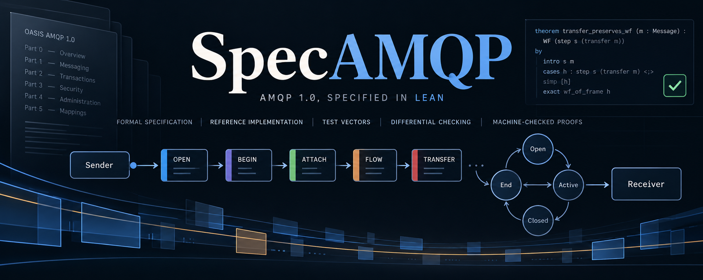

# SpecAMQP

An **executable formal specification of AMQP 1.0 core** (OASIS Standard, Parts 0–5) written in Lean 4, a
clause-level ledger that makes completeness and fidelity measurable, and a **second, independently written
implementation** of the same standard. The second implementation catches misreadings: it is written from the
same OASIS artifacts without reference to the specification, the two run the same vectors, and a disagreement
between them means one has misread the standard.

- **579 clauses** of the standard, each with a recorded disposition: 238 formalized, 105 covered by test
  vectors, 180 deferred to a named milestone, and the rest informative, out of scope or superseded.
- **24 test corpora**, replayed step by step against the specification's executable semantics and against the
  reference implementation, comparing each step's verdict and the condition behind every refusal.
- **20 gates** in `tests/contracts/`, each a script with a pass/fail exit status, runnable offline.
- **76 Lean modules**, and an endpoint in `lean/Impl/` compiled by Lean's own C backend whose protocol core
  is proved to conform to the specification.


Conformance is defined as a state machine over a fixed interface alphabet, so any implementation can be checked against the specification directly. `PLAN.md` is the programme of record.

## What is here

| layer | what it holds |
|---|---|
| `spec/oasis/` | the vendored OASIS artifacts, byte-identity pinned in `toolchain/sources.toml`; every clause id, disposition and citation refers to these bytes |
| `lean/Generated/` | the standard's declared surface — descriptors, encodings, types, fields, choices — as generated Lean data |
| `lean/Spec/` | the handwritten semantics: executable, total, and independent of every consumer |
| `lean/Ref/` | a second, independently written reading of the same artifacts, sharing no definition with `lean/Spec/`; where the two disagree on a vector, one of them has misread the standard |
| `lean/Impl/` | the shipped endpoint: its protocol core, proved to conform, and `Transport.lean`, its socket boundary — the one module there that is not proved |
| `lean/Shell/` | the shipped process: the recv/feed/write loop and the socket lifecycle |
| `lean/Harness/`, `lean/Contracts/`, `lean/Proofs/` | the runner and its reason-class vocabulary; the acceptance declarations; their proofs |
| `ledger/` | the clause ledger, its coverage and reconciliation, and the **ambiguity register** — every place the standard is silent and a reading was taken |
| `vectors/` | the test vectors, each authored from a clause or recorded from a third-party implementation |
| `tests/contracts/` | the gates |
| `bench/` | off-gate timing evidence for the corpus instruments |
| `PLAN.md` | the programme of record, including its own rules of evidence |

## Status

What is done:

- Every clause of the standard (Parts 0–5; 579 clauses) has a disposition: 238 formalized, 105 covered by
  test vectors, 180 deferred to named work, and the rest informative, out of scope or superseded.
- Every ambiguity found so far is written down in `ledger/ambiguities/`, with the reading and the alternatives it was
  chosen over.
- The specification (`lean/Spec/`) and the reference implementation (`lean/Ref/`) agree on every committed
  corpus. `scripts/staged-exchange-divergences.ndjson` lists the vectors that do not yet pass, with their
  failing steps.
- The endpoint's protocol core is proved to conform: `Proofs/EndpointConformance.lean` proves the statement
  frozen in `Contracts/EndpointConformance.lean`, bound by `Contracts/EndpointAcceptance.lean`. Its framing
  laws are proved too.
- 20 gates in `tests/contracts/` check the above, and they run offline.

What is not done:

- 180 clauses are deferred. The largest groups are sessions and links (49), transactions (44), messages
  (37) and session state (32); the rest are spread across the other layers.
- `lean/Impl/Transport.lean`, the socket boundary, and `lean/Shell/`, the process loop above it, are not
  proved. The shipped binary therefore rests on Lean's compiler and runtime, which are not verified.
- The stream corollary that waits on `ValuePrefixDetermined`, and the delivery contract a second connection
  would rest on.
- The wire differential — the corpus replayed against the shipped binary over a real socket, compared per
  vector with `amqp-spec` — has its current result in `tests/contracts/r4_wire_differential.sh`.

Numbers come from the ledger and the gates; run them for current values. `PLAN.md`
has the decisions and their history.

## Running it

Everything runs in the pinned shell; the first `nix develop` realizes the closure and later runs are offline.

```sh
alias shell='nix --extra-experimental-features "nix-command flakes" develop --offline --no-update-lock-file .#spec --command'

shell bash tests/contracts/s0_sources_ledger.sh      # vendored identity, ledger, dispositions
shell bash tests/contracts/s0_tables_fidelity.sh     # generated tables current and load-bearing
shell bash tests/contracts/s0_spec_manifest.sh       # planner-owned files as the manifest records them
shell bash tests/contracts/s0_vector_citations.sh    # every citation in the corpus resolves
shell bash tests/contracts/s0_generator_fidelity.sh  # each corpus is what its generator produces

shell bash tests/contracts/s1_proof_integrity.sh     # no sorry, no native_decide; axiom inventories
shell bash tests/contracts/s1_differential.sh        # specification and reference agree on the wire
shell bash tests/contracts/s2_frame_vectors.sh       # the frame layer's corpus
shell bash tests/contracts/s3_exchanges.sh           # the exchange corpora, both artefacts
shell bash tests/contracts/s5_messages.sh            # the message layer's differential
shell bash tests/contracts/s6_transactions.sh        # the transaction layer's differential
shell bash tests/contracts/s7_sasl.sh                # the security layer
shell bash tests/contracts/r4_wire_differential.sh   # the endpoint over a socket, per vector

shell python3 scripts/clause-ledger.py check         # ledger, dispositions and reconciliation
shell python3 scripts/gen-oasis-lean.py --check      # generated tables current
```

## How it is checked

- **Proofs.** No `sorry`, `native_decide`, `axiom`, `opaque`, `unsafe` or `extern` in the handwritten
  modules, with each accepted theorem's transitive axiom inventory printed.
- **The corpus.** Both implementations replay the same vectors; the differential compares verdicts and the
  condition each refusal names.
- **Third-party evidence.** Recordings from implementations written outside this model.
- **Mutation controls.** For each semantic layer, structural, boundary, omission and polarity mutants are
  planted, and the gate reports which of them the corpus fails to catch.

## License

The work of this repository — the specification, the reference, the ledger, the corpus, the gates and the
scripts — is licensed under the **Apache License 2.0**; see `LICENSE`.

The vendored OASIS artifacts under `spec/oasis/` are **not** covered by that license. They are the OASIS
Standard's own text, redistributed unmodified under their own terms, which `spec/oasis/` carries alongside
them. Nothing in this repository re-licenses them.
